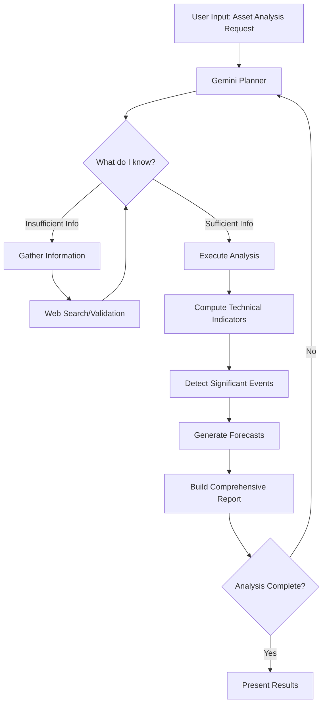
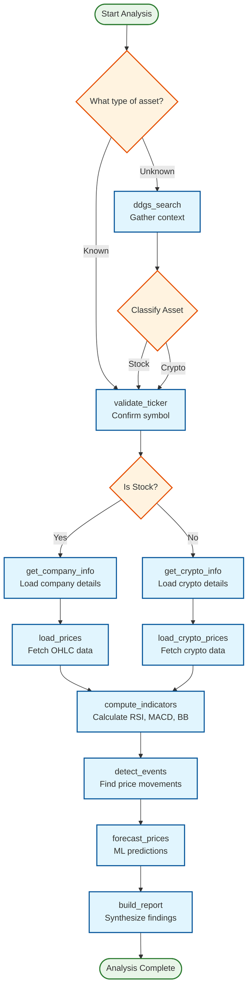

# Agentic-Ticker 🤖

A sophisticated demonstration of Agentic AI principles through a stock and cryptocurrency analysis system powered by Google Gemini. This project showcases how AI agents can autonomously plan, execute, and reason through complex analytical workflows.

## 🎯 Overview

Agentic-Ticker demonstrates the core concepts of Agentic AI by implementing a self-directed analysis system that:

- **Autonomously plans** analysis strategies using Google Gemini as the reasoning engine
- **Dynamically adapts** to different asset types (stocks vs cryptocurrencies)
- **Intelligently sequences** function calls based on context and available data
- **Provides natural language reasoning** for each decision step
- **Handles uncertainty** by gathering additional information when needed

Unlike traditional scripted workflows, this system thinks and acts like a human analyst - determining what information is needed, gathering it systematically, and building comprehensive insights.

## 🧠 How Agentic AI Works

### The Agent Loop

The system operates on a continuous **Plan → Execute → Reason → Repeat** cycle:



### Decision Flow Diagram



### Key Agentic Behaviors

1. **Context-Aware Planning**: The agent assesses available information and determines next steps
2. **Dynamic Function Selection**: Chooses appropriate tools based on asset type and analysis needs
3. **Natural Language Reasoning**: Explains each decision in human-readable terms
4. **Error Recovery**: Handles missing data by seeking additional information
5. **Progressive Refinement**: Builds understanding incrementally through multiple steps

## 🚀 Features

### Core Capabilities
- **Multi-Asset Support**: Analyzes both stocks and cryptocurrencies
- **Intelligent Classification**: Automatically determines asset type from user input
- **Web Integration**: Uses DuckDuckGo search for context gathering
- **Technical Analysis**: Computes RSI, MACD, Bollinger Bands, and volatility
- **Event Detection**: Identifies significant price movements based on thresholds
- **ML Forecasting**: Generates price predictions using machine learning models
- **Comprehensive Reporting**: Synthesizes all findings into actionable insights

### Agentic Features
- **Self-Directed Workflow**: No predefined execution order
- **Contextual Decision Making**: Adapts strategy based on available data
- **Natural Language Explanations**: Shows reasoning for each step
- **Dynamic Tool Selection**: Chooses appropriate functions automatically
- **Progressive Understanding**: Builds knowledge through iterative analysis

## 🛠️ Technical Architecture

### System Components

```
┌─────────────────────────────────────────────────────────────┐
│                    Streamlit UI Layer                       │
│  ┌─────────────┐  ┌─────────────┐  ┌─────────────┐        │
│  │   Logs      │  │  Parameters │  │   Report    │        │
│  └─────────────┘  └─────────────┘  └─────────────┘        │
└─────────────────────────────────────────────────────────────┘
                              │
┌─────────────────────────────────────────────────────────────┐
│                   Orchestrator Layer                        │
│  ┌─────────────┐  ┌─────────────┐  ┌─────────────┐        │
│  │   Planner   │  │   Tools     │  │  Context    │        │
│  │  (Gemini)   │  │  Registry   │  │  Manager    │        │
│  └─────────────┘  └─────────────┘  └─────────────┘        │
└─────────────────────────────────────────────────────────────┘
                              │
┌─────────────────────────────────────────────────────────────┐
│                   Services Layer                            │
│  ┌─────────────┐  ┌─────────────┐  ┌─────────────┐        │
│  │   Data      │  │  Analysis   │  │  Reporting  │        │
│  │  Services   │  │  Services   │  │  Services   │        │
│  └─────────────┘  └─────────────┘  └─────────────┘        │
└─────────────────────────────────────────────────────────────┘
```

### Available Tools (Functions)

**Information Gathering:**
- `ddgs_search` - Web search for context gathering
- `validate_ticker` - Asset symbol validation and normalization
- `get_company_info` - Company details retrieval
- `get_crypto_info` - Cryptocurrency metadata retrieval

**Data Processing:**
- `load_prices` - Historical stock price data
- `load_crypto_prices` - Historical crypto price data
- `compute_indicators` - Technical indicator calculations

**Analysis:**
- `detect_events` - Significant price movement detection
- `forecast_prices` - Machine learning price predictions

**Reporting:**
- `build_report` - Comprehensive analysis synthesis

## 📦 Prerequisites

- **Python 3.11+** - Core runtime environment
- **Google Gemini API Key** - AI reasoning engine
- **Required Python packages** - Listed in requirements.txt

## 🚀 Installation

1. **Clone the repository:**
   ```bash
   git clone <repository-url>
   cd agentic-ticker
   ```

2. **Set up environment variables:**
   ```bash
   cp .env.example .env
   # Edit .env with your Google Gemini API key
   ```

3. **Install Python dependencies:**
   ```bash
   pip install -r requirements.txt
   ```

## 🎮 Usage

### Running the Application

```bash
streamlit run agentic_ticker.py
```

Then open your browser to the provided URL (typically http://localhost:8501).

### Example Workflows

**Stock Analysis:**
```
Input: "Apple Inc. stock"
→ Web search for context
→ Classify as stock
→ Validate ticker (AAPL)
→ Get company information
→ Load historical prices
→ Compute technical indicators
→ Detect significant events
→ Generate forecasts
→ Build comprehensive report
```

**Cryptocurrency Analysis:**
```
Input: "BTC"
→ Web search for context
→ Classify as cryptocurrency
→ Validate ticker (BTC)
→ Get crypto information
→ Load historical prices
→ Compute technical indicators
→ Detect significant events
→ Generate forecasts
→ Build comprehensive report
```

## 📁 Project Structure

```
├── agentic_ticker.py          # Main Streamlit application
├── src/                       # Core modules
│   ├── orchestrator.py        # Agent loop and coordination
│   ├── planner.py             # Gemini-powered reasoning
│   ├── services.py            # Analysis functions and tools
│   ├── data_models.py         # Data structures and validation
│   ├── ui_components.py       # Visualization components
│   └── json_helpers.py        # JSON processing utilities
├── .specify/                  # Specification-driven development
│   ├── memory/                # Agent memory and context
│   ├── scripts/               # Development automation
│   └── templates/             # Document templates
├── requirements.txt           # Python dependencies
├── setup.cfg                  # Development configuration
└── README.md                  # This documentation
```

## 🧪 Development

### Specification-Driven Development

This project follows a rigorous specification-driven approach:

- **Feature Specifications**: Clear requirements and acceptance criteria
- **Implementation Plans**: Detailed technical roadmaps
- **Task Breakdowns**: Granular development tasks
- **Automated Testing**: Comprehensive test coverage
- **Modular Architecture**: Clean separation of concerns

### Running Tests

```bash
# Run all tests
pytest tests/

# Run specific test categories
pytest tests/unit/
pytest tests/integration/
```

### Code Quality

```bash
# Linting
flake8 src/

# Type checking
mypy src/

# Security scanning
bandit -r src/
```

## 🔧 Configuration

### Environment Variables

| Variable | Description | Required |
|----------|-------------|----------|
| `GEMINI_API_KEY` | Google Gemini API key | Yes |
| `GEMINI_MODEL` | Gemini model to use | No (default: gemini-2.5-flash-lite) |
| `GEMINI_API_BASE` | Gemini API base URL | No (default: Google's API) |
| `COINGECKO_DEMO_API_KEY` | CoinGecko API key for crypto data | No |

### Customization

The agent's behavior can be customized by:

1. **Modifying the Planner**: Adjust prompts and reasoning logic in `src/planner.py`
2. **Adding New Tools**: Extend the tool registry in `src/orchestrator.py`
3. **Enhancing Analysis**: Add new analysis functions in `src/services.py`
4. **UI Customization**: Modify the Streamlit interface in `agentic_ticker.py`

## 🤝 Contributing

We welcome contributions! Please see our contributing guidelines for:

1. **Code Standards**: Follow PEP 8 and type hints
2. **Testing Requirements**: Maintain test coverage
3. **Documentation**: Update README and docstrings
4. **Pull Request Process**: Template and review criteria

## 📄 License

This project is licensed under the MIT License - see the LICENSE file for details.

## 🙏 Acknowledgments

- **Google Gemini** - For providing the reasoning engine
- **Streamlit** - For the excellent UI framework
- **yFinance** - For financial data access
- **CoinGecko** - For cryptocurrency data
- **DuckDuckGo** - For web search capabilities

## 📞 Support

For questions, issues, or contributions:

- **GitHub Issues**: Report bugs and request features
- **Discussions**: Share ideas and use cases
- **Documentation**: Check inline code documentation

---

**Built with ❤️ to demonstrate the power of Agentic AI**