# Agentic-Ticker 🤖

> **⚠️ Educational Purpose Only**: This project is for educational demonstration purposes only and should not be used for actual financial research, trading decisions, or investment advice.

A demonstration of Agentic AI principles through a stock and cryptocurrency analysis system powered by Google Gemini. This project showcases how AI agents autonomously plan, execute, and reason through complex analytical workflows. The only task of the LLM is to decide which functions to call and in what order. It does not write any code itself or perform any analysis directly. It simply orchestrates the available tools to achieve the desired outcome.

## 🎯 Overview

Agentic-Ticker demonstrates how an LLM (Google Gemini) autonomously calls different functions to analyze assets:

- **LLM decides** which functions to call based on user input
- **Sequences function calls** dynamically (web search → validation → data loading → analysis)
- **Adapts to asset type** (stocks vs cryptocurrencies)
- **Explains reasoning** for each function call in natural language

## 🧠 How Agentic AI Works

### The True Agentic Loop

The system operates on a continuous **LLM Orchestrator Loop** where the LLM is called repeatedly, with each function's output being fed back as context for the next decision:

```mermaid
graph TD
    Start["User Input: Asset Analysis Request"] --> Init["Initialize Context<br/>ticker_input, days, threshold, forecast_days<br/>asset_type: 'ambiguous'"]
    Init --> LoopStart{"step_count < max_steps (10)?"}
    
    LoopStart -->|Yes| PrepareLLMCall["Prepare LLM Call<br/>• Get tools_spec<br/>• Copy transcript<br/>• Add context summary to transcript<br/>• Context shows available data keys"]
    PrepareLLMCall --> LLMCall["🤖 Call LLM Orchestrator<br/>Pass: tools_spec + transcript + context<br/>LLM sees full execution history"]
    
    LLMCall --> LLMAnalyze{"LLM Analysis:<br/>What data do I have?<br/>What function should I call next?"}
    
    LLMAnalyze -->|Need more data| CheckAssetType{"What type of asset?<br/>Based on input + context"}
    CheckAssetType -->|Unknown| SearchDecision{"Should I search web?<br/>Do I have context about this asset?"}
    SearchDecision -->|No web context| CallWebSearch["Call: ddgs_search(query=ticker_input)"]
    SearchDecision -->|Have web context| ValidateDecision{"Should I validate ticker?<br/>Do I have validated_ticker?"}
    
    CheckAssetType -->|Known| ValidateDecision
    
    CallWebSearch --> WebResult["Web search results stored<br/>context['ddgs_search'] = results"]
    WebResult --> ValidateDecision
    
    ValidateDecision -->|No validated ticker| CallValidate["Call: validate_ticker(input_text=ticker_input)"]
    ValidateDecision -->|Have validated ticker| InfoDecision{"Should I get asset info?<br/>Do I have company/crypto info?"}
    
    CallValidate --> ValidateResult["Validation result stored<br/>context['validate_ticker'] = ticker<br/>context['validated_ticker'] = ticker"]
    ValidateResult --> InfoDecision
    
    InfoDecision -->|No asset info| CheckAssetInfo{"Is this stock or crypto?<br/>Check context or classify"}
    CheckAssetInfo -->|Stock| CallCompanyInfo["Call: get_company_info(ticker=validated_ticker)"]
    CheckAssetInfo -->|Crypto| CallCryptoInfo["Call: get_crypto_info(ticker=validated_ticker, original_input=ticker_input)"]
    
    CallCompanyInfo --> CompanyResult["Company info stored<br/>context['get_company_info'] = data"]
    CallCryptoInfo --> CryptoResult["Crypto info stored<br/>context['get_crypto_info'] = data"]
    CompanyResult --> PriceDecision
    CryptoResult --> PriceDecision
    
    InfoDecision -->|Have asset info| PriceDecision{"Should I load prices?<br/>Do I have price data?"}
    PriceDecision -->|No price data| CallLoadPrices["Call: load_prices/load_crypto_prices<br/>(ticker=validated_ticker, days=days)"]
    PriceDecision -->|Have price data| IndicatorDecision{"Should I compute indicators?<br/>Do I have indicator data?"}
    
    CallLoadPrices --> PriceResult["Price data stored<br/>context['load_prices'] = data"]
    PriceResult --> IndicatorDecision
    
    IndicatorDecision -->|No indicators| CallIndicators["Call: compute_indicators(indicator_data=price_data_key)"]
    IndicatorDecision -->|Have indicators| EventDecision{"Should I detect events?<br/>Do I have events data?"}
    
    CallIndicators --> IndicatorResult["Indicators stored<br/>context['compute_indicators'] = data"]
    IndicatorResult --> EventDecision
    
    EventDecision -->|No events| CallEvents["Call: detect_events(indicator_data=indicators_key, threshold=threshold)"]
    EventDecision -->|Have events| ForecastDecision{"Should I forecast?<br/>Do I have forecast data?"}
    
    CallEvents --> EventResult["Events stored<br/>context['detect_events'] = data"]
    EventResult --> ForecastDecision
    
    ForecastDecision -->|No forecast| CallForecast["Call: forecast_prices(indicator_data=indicators_key, days=forecast_days)"]
    ForecastDecision -->|Have forecast| ReportDecision{"Should I build report?<br/>Do I have all required data?"}
    
    CallForecast --> ForecastResult["Forecast stored<br/>context['forecast_prices'] = data"]
    ForecastResult --> ReportDecision
    
    ReportDecision -->|Missing data| LLMAnalyze
    ReportDecision -->|Have all data| CallReport["Call: build_report(ticker=validated_ticker, events=events_key, forecasts=forecasts_key, company_info=info_key)"]
    
    CallReport --> ReportResult["Report generated<br/>Return final result"]
    ReportResult --> LLMFinal{"LLM Decision:<br/>Return final result?"}
    
    LLMAnalyze -->|Have all data| LLMFinal
    LLMFinal -->|Yes| FinalResult["Return final analysis<br/>Break loop"]
    LLMFinal -->|No| UpdateContext["Update context and transcript<br/>Add function result to context<br/>Add call + result to transcript"]
    
    UpdateContext --> IncrementStep["Increment step_count<br/>step_count++"]
    IncrementStep --> LoopStart
    
    LoopStart -->|No| End["Present Final Results"]
    
    FinalResult --> End
    
    %% Style nodes
    classDef process fill:#1976d2,stroke:#0d47a1,stroke-width:2px,color:#ffffff
    classDef decision fill:#f57c00,stroke:#e65100,stroke-width:2px,color:#ffffff
    classDef llm fill:#9c27b0,stroke:#4a148c,stroke-width:2px,color:#ffffff
    classDef startend fill:#388e3c,stroke:#1b5e20,stroke-width:2px,color:#ffffff
    classDef function fill:#4caf50,stroke:#2e7d32,stroke-width:2px,color:#ffffff
    
    class Start,Init,End startend
    class LoopStart,LLMAnalyze,CheckAssetType,SearchDecision,ValidateDecision,InfoDecision,CheckAssetInfo,PriceDecision,IndicatorDecision,EventDecision,ForecastDecision,ReportDecision,LLMFinal decision
    class PrepareLLMCall,LLMCall,UpdateContext,IncrementStep process
    class CallWebSearch,CallValidate,CallCompanyInfo,CallCryptoInfo,CallLoadPrices,CallIndicators,CallEvents,CallForecast,CallReport function
    class WebResult,ValidateResult,CompanyResult,CryptoResult,PriceResult,IndicatorResult,EventResult,ForecastResult,ReportResult,FinalResult process
    class LLMCall llm
```



### 🎨 Diagram Legend

| Color | Node Type | Description | Examples |
|-------|-----------|-------------|----------|
| 🟢 **Green** | **Start/End Points** | Entry and exit points of the workflow | User Input, Initialize Context, Present Final Results |
| 🔵 **Blue** | **Process Steps** | System operations and data handling | Prepare LLM Call, Update Context, Store Results |
| 🟠 **Orange** | **Decision Points** | LLM or system logic decisions | What data do I have? Should I call function? Continue loop? |
| 🟣 **Purple** | **LLM Operations** | Direct LLM interactions and analysis | Call LLM Orchestrator, LLM Analysis |
| 🟢 **Light Green** | **Function Calls** | Actual function executions | ddgs_search, validate_ticker, compute_indicators |

### 🔄 Flow Patterns

**Decision Flow**: Orange diamonds represent branching logic where the LLM decides next actions based on available context.

**Data Flow**: Blue rectangles show how data moves through the system - context updates, transcript management, and step counting.

**Function Execution**: Light green rectangles show actual function calls that happen when the LLM decides they're needed.

**LLM Interaction**: Purple nodes highlight where the LLM is directly involved in analysis and decision-making.

**Loop Control**: The diagram shows the actual loop structure with `step_count < max_steps (10)` as the main loop condition, demonstrating how the LLM is called repeatedly until analysis is complete.

### How the LLM Orchestrator Actually Works

The LLM is not just a planner - it's the central orchestrator that controls the entire workflow through repeated calls, with a critical data flow mechanism:

1. **LLM Call**: LLM receives tools specification, execution transcript, and context summary
2. **Function Decision**: LLM decides which function to call next and what arguments to use
3. **Argument Processing**: System replaces context key references with actual data from previous results
4. **Function Execution**: Selected function runs with processed arguments and returns result
5. **Context Storage**: Result is stored in context dictionary using function name as key
6. **Transcript Update**: Function call, result, and context summary are added to execution transcript
7. **Repeat**: Steps 1-6 repeat until LLM decides to return final result

**Key Innovation - Context-Aware Argument Passing**:
The LLM can pass context keys as function arguments, and the system automatically replaces them with actual data:

```
LLM says: load_prices(ticker="validated_ticker")
System sees: "validated_ticker" is a context key
System replaces: load_prices(ticker="AAPL")  // Uses actual data from context
```

**Real Example Flow**:
```
Iteration 1: LLM calls ddgs_search("Apple stock") 
           → Context: {'ddgs_search': [search_results]}

Iteration 2: LLM calls validate_ticker("Apple stock")
           → Context: {'ddgs_search': [...], 'validate_ticker': 'AAPL'}

Iteration 3: LLM calls get_company_info(ticker="validate_ticker")
           → System replaces: get_company_info(ticker="AAPL")
           → Context: {..., 'get_company_info': {company_data}}

Iteration 4: LLM calls load_prices(ticker="validate_ticker", days=30)
           → System replaces: load_prices(ticker="AAPL", days=30)
           → Context: {..., 'load_prices': [price_data]}

Iteration 5: LLM calls compute_indicators(indicator_data="load_prices")
           → System replaces: compute_indicators(indicator_data=[price_data])
           → Context: {..., 'compute_indicators': [indicators]}

Iteration 6: LLM calls detect_events(indicator_data="compute_indicators", threshold=2.0)
           → System replaces: detect_events(indicator_data=[indicators], threshold=2.0)
           → Context: {..., 'detect_events': [events]}

Iteration 7: LLM calls build_report(ticker="validate_ticker", events="detect_events", 
                                  forecasts="forecast_prices", company_info="get_company_info")
           → System replaces all context keys with actual data
           → Returns final analysis
```

This creates a true agentic loop where the LLM maintains state across multiple calls and can chain function outputs as inputs to subsequent functions, enabling complex data analysis workflows.

### How LLM Orchestrates Functions

The LLM serves as the central orchestrator in a continuous loop:

1. **Iterative Planning**: LLM is called repeatedly (up to 10 times), each time seeing the complete execution history
2. **Context-Aware Decisions**: Each LLM call has access to all previous function results via the context dictionary
3. **Dynamic Function Selection**: LLM chooses the next function based on current state, not a predefined sequence
4. **Result Integration**: Function outputs are stored in context and become available for subsequent LLM calls
5. **Adaptive Termination**: LLM decides when to stop calling functions and return the final analysis

**Critical Difference**: Unlike simple function chaining, the LLM maintains state across multiple calls and can adapt its strategy based on intermediate results, errors, or unexpected data.

## 🚀 Features

### What the System Does
- **Asset Analysis**: Analyzes stocks and cryptocurrencies with technical indicators
- **Interactive Charts**: Displays price charts, technical indicators, and forecasts
- **Web Search**: Gathers context about unknown assets using DuckDuckGo
- **Technical Analysis**: Calculates RSI, MACD, Bollinger Bands
- **Price Forecasts**: Generates basic ML predictions
- **Natural Language Reports**: Provides analysis explanations

### How LLM Controls the Flow
- **No Fixed Script**: LLM decides function call sequence dynamically
- **Context-Aware**: Adapts based on available information
- **Self-Correcting**: Handles errors by trying alternative approaches
- **Explains Decisions**: Shows reasoning for each function call

## 🛠️ Technical Architecture

### System Architecture

```
┌─────────────────────────────────────────────────────────────┐
│                    Streamlit UI                             │
│  ┌─────────────┐  ┌─────────────┐  ┌─────────────┐        │
│  │   Charts    │  │   Input     │  │   Logs      │        │
│  └─────────────┘  └─────────────┘  └─────────────┘        │
└─────────────────────────────────────────────────────────────┘
                               │
┌─────────────────────────────────────────────────────────────┐
│                 LLM Orchestrator                            │
│  ┌─────────────┐  ┌─────────────┐  ┌─────────────┐        │
│  │   Gemini    │  │   Function  │  │   Context   │        │
│  │   Planner   │  │   Registry  │  │   Manager   │        │
│  └─────────────┘  └─────────────┘  └─────────────┘        │
└─────────────────────────────────────────────────────────────┘
                               │
┌─────────────────────────────────────────────────────────────┐
│                 Available Functions                         │
│  ┌─────────────┐  ┌─────────────┐  ┌─────────────┐        │
│  │   Search    │  │   Data      │  │  Analysis   │        │
│  │   Tools     │  │   Loading   │  │   Tools     │        │
│  └─────────────┘  └─────────────┘  └─────────────┘        │
└─────────────────────────────────────────────────────────────┘
```

### Available Functions

**Search & Validation:**
- `ddgs_search` - Web search for asset context
- `validate_ticker` - Confirm asset symbol exists

**Data Loading:**
- `get_company_info` - Company details (stocks)
- `get_crypto_info` - Crypto details (cryptocurrencies)
- `load_prices` - Historical price data (stocks)
- `load_crypto_prices` - Historical price data (crypto)

**Analysis Functions:**
- `compute_indicators` - Calculate RSI, MACD, Bollinger Bands
- `detect_events` - Find significant price movements
- `forecast_prices` - Generate price predictions
- `build_report` - Create final analysis report

## 📦 Prerequisites

- **Python 3.11+** - Core runtime environment
- **Google Gemini API Key** - AI reasoning engine
- **Required Python packages** - Listed in requirements.txt

## 🚀 Installation

1. **Clone the repository:**
   ```bash
   git clone <repository-url>
   cd agentic-ticker
   ```

2. **Set up environment variables:**
   ```bash
   cp .env.example .env
   # Edit .env with your Google Gemini API key
   ```

3. **Install Python dependencies:**
   ```bash
   pip install -r requirements.txt
   ```

## 🎮 Usage

### Running the Application

```bash
streamlit run agentic_ticker.py
```

Then open your browser to the provided URL (typically http://localhost:8501).

### Example Workflows

**Stock Analysis:**
```
Input: "Apple Inc. stock"
→ Web search for context
→ Classify as stock
→ Validate ticker (AAPL)
→ Get company information
→ Load historical prices
→ Compute technical indicators
→ Detect significant events
→ Generate forecasts
→ Build comprehensive report
```

**Cryptocurrency Analysis:**
```
Input: "BTC"
→ Web search for context
→ Classify as cryptocurrency
→ Validate ticker (BTC)
→ Get crypto information
→ Load historical prices
→ Compute technical indicators
→ Detect significant events
→ Generate forecasts
→ Build comprehensive report
```

## 📁 Project Structure

```
├── agentic_ticker.py          # Main Streamlit application
├── src/                       # Core modules
│   ├── orchestrator.py        # Agent loop and coordination
│   ├── planner.py             # Gemini-powered reasoning
│   ├── services.py            # Analysis functions and tools
│   ├── data_models.py         # Data structures and validation
│   ├── ui_components.py       # Visualization components
│   └── json_helpers.py        # JSON processing utilities
├── tests/                     # Test suite
│   ├── conftest.py           # Test configuration and fixtures
│   ├── test_data_models.py    # Data model tests
│   ├── test_integration.py    # Integration tests
│   ├── test_orchestrator.py  # Orchestrator tests
│   ├── test_services.py       # Service function tests
│   └── test_ui_components.py # UI component tests
├── .devcontainer/             # Development container configuration
├── .env.example              # Environment variables template
├── .gitignore               # Git ignore rules
├── AGENTS.md                # Agent documentation
├── launch.json              # Launch configuration
├── requirements.txt         # Python dependencies
├── setup.cfg                # Development configuration
└── README.md                # This documentation
```

## 🧪 Development

### Development Approach

This project demonstrates:

- **LLM Function Calling**: How Gemini autonomously selects and sequences functions
- **Dynamic Workflows**: No predefined execution order - LLM decides next steps
- **Error Handling**: LLM adapts when functions fail or return unexpected results
- **Context Management**: LLM maintains state across multiple function calls

### Running Tests

```bash
# Run all tests
pytest tests/

# Run specific test file
pytest tests/test_services.py

```


## 🔧 Configuration

### Environment Variables

| Variable | Description | Required |
|----------|-------------|----------|
| `GEMINI_API_KEY` | Google Gemini API key | Yes |
| `GEMINI_MODEL` | Gemini model to use | No (default: gemini-2.5-flash-lite) |
| `GEMINI_API_BASE` | Gemini API base URL | No (default: Google's API) |
| `COINGECKO_DEMO_API_KEY` | CoinGecko API key for crypto data | No |

### Customization

The agent's behavior can be customized by:

1. **Modifying the Planner**: Adjust prompts and reasoning logic in `src/planner.py`
2. **Adding New Tools**: Extend the tool registry in `src/orchestrator.py`
3. **Enhancing Analysis**: Add new analysis functions in `src/services.py`
4. **UI Customization**: Modify the Streamlit interface in `agentic_ticker.py`

## 📄 License

This project is licensed under the MIT License - see the LICENSE file for details.

## 🙏 Acknowledgments

This project is built using open source libraries and free APIs:

- **[Google Gemini](https://ai.google.dev/)** - AI reasoning engine
- **[Streamlit](https://github.com/streamlit/streamlit)** - UI framework
- **[yFinance](https://github.com/ranaroussi/yfinance)** - Financial data access
- **[CoinGecko SDK](https://github.com/man-c/pycoingecko)** - Cryptocurrency data
- **[DDGS Search](https://github.com/deedy5/ddgs)** - Web search capabilities

## 📞 Support

For questions, issues, or contributions:

- **GitHub Issues**: Report bugs and request features
- **Discussions**: Share ideas and use cases
- **Documentation**: Check inline code documentation

---

**Built to demonstrate the power of Agentic AI**