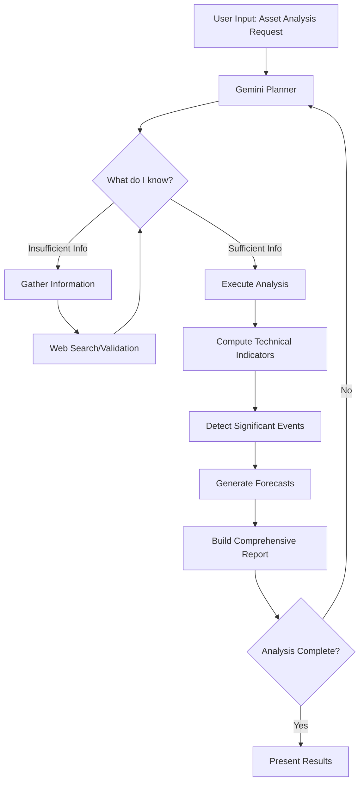
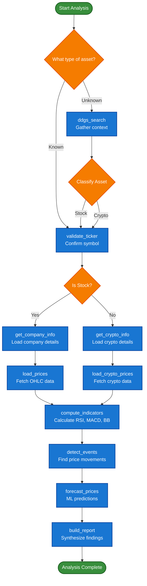

# Agentic-Ticker 🤖

> **⚠️ Educational Purpose Only**: This project is for educational demonstration purposes only and should not be used for actual financial research, trading decisions, or investment advice.

A demonstration of Agentic AI principles through a stock and cryptocurrency analysis system powered by Google Gemini. This project showcases how AI agents autonomously plan, execute, and reason through complex analytical workflows.

## 🎯 Overview

Agentic-Ticker demonstrates how an LLM (Google Gemini) autonomously calls different functions to analyze assets:

- **LLM decides** which functions to call based on user input
- **Sequences function calls** dynamically (web search → validation → data loading → analysis)
- **Adapts to asset type** (stocks vs cryptocurrencies)
- **Explains reasoning** for each function call in natural language

## 🧠 How Agentic AI Works

### The Agent Loop

The system operates on a continuous **Plan → Execute → Reason → Repeat** cycle:



### Decision Flow Diagram



### How LLM Calls Functions

The LLM analyzes user input and decides which functions to call:

1. **Input Analysis**: LLM determines asset type and what information is needed
2. **Function Selection**: LLM chooses appropriate functions from available tools
3. **Sequential Execution**: LLM calls functions in logical order (search → validate → analyze)
4. **Result Processing**: LLM interprets function outputs and decides next steps
5. **Report Generation**: LLM synthesizes all findings into final analysis

## 🚀 Features

### What the System Does
- **Asset Analysis**: Analyzes stocks and cryptocurrencies with technical indicators
- **Interactive Charts**: Displays price charts, technical indicators, and forecasts
- **Web Search**: Gathers context about unknown assets using DuckDuckGo
- **Technical Analysis**: Calculates RSI, MACD, Bollinger Bands
- **Price Forecasts**: Generates basic ML predictions
- **Natural Language Reports**: Provides analysis explanations

### How LLM Controls the Flow
- **No Fixed Script**: LLM decides function call sequence dynamically
- **Context-Aware**: Adapts based on available information
- **Self-Correcting**: Handles errors by trying alternative approaches
- **Explains Decisions**: Shows reasoning for each function call

## 🛠️ Technical Architecture

### System Architecture

```
┌─────────────────────────────────────────────────────────────┐
│                    Streamlit UI                             │
│  ┌─────────────┐  ┌─────────────┐  ┌─────────────┐        │
│  │   Charts    │  │   Input     │  │   Logs      │        │
│  └─────────────┘  └─────────────┘  └─────────────┘        │
└─────────────────────────────────────────────────────────────┘
                               │
┌─────────────────────────────────────────────────────────────┐
│                 LLM Orchestrator                            │
│  ┌─────────────┐  ┌─────────────┐  ┌─────────────┐        │
│  │   Gemini    │  │   Function  │  │   Context   │        │
│  │   Planner   │  │   Registry  │  │   Manager   │        │
│  └─────────────┘  └─────────────┘  └─────────────┘        │
└─────────────────────────────────────────────────────────────┘
                               │
┌─────────────────────────────────────────────────────────────┐
│                 Available Functions                         │
│  ┌─────────────┐  ┌─────────────┐  ┌─────────────┐        │
│  │   Search    │  │   Data      │  │  Analysis   │        │
│  │   Tools     │  │   Loading   │  │   Tools     │        │
│  └─────────────┘  └─────────────┘  └─────────────┘        │
└─────────────────────────────────────────────────────────────┘
```

### Available Functions

**Search & Validation:**
- `ddgs_search` - Web search for asset context
- `validate_ticker` - Confirm asset symbol exists

**Data Loading:**
- `get_company_info` - Company details (stocks)
- `get_crypto_info` - Crypto details (cryptocurrencies)
- `load_prices` - Historical price data (stocks)
- `load_crypto_prices` - Historical price data (crypto)

**Analysis Functions:**
- `compute_indicators` - Calculate RSI, MACD, Bollinger Bands
- `detect_events` - Find significant price movements
- `forecast_prices` - Generate price predictions
- `build_report` - Create final analysis report

## 📦 Prerequisites

- **Python 3.11+** - Core runtime environment
- **Google Gemini API Key** - AI reasoning engine
- **Required Python packages** - Listed in requirements.txt

## 🚀 Installation

1. **Clone the repository:**
   ```bash
   git clone <repository-url>
   cd agentic-ticker
   ```

2. **Set up environment variables:**
   ```bash
   cp .env.example .env
   # Edit .env with your Google Gemini API key
   ```

3. **Install Python dependencies:**
   ```bash
   pip install -r requirements.txt
   ```

## 🎮 Usage

### Running the Application

```bash
streamlit run agentic_ticker.py
```

Then open your browser to the provided URL (typically http://localhost:8501).

### Example Workflows

**Stock Analysis:**
```
Input: "Apple Inc. stock"
→ Web search for context
→ Classify as stock
→ Validate ticker (AAPL)
→ Get company information
→ Load historical prices
→ Compute technical indicators
→ Detect significant events
→ Generate forecasts
→ Build comprehensive report
```

**Cryptocurrency Analysis:**
```
Input: "BTC"
→ Web search for context
→ Classify as cryptocurrency
→ Validate ticker (BTC)
→ Get crypto information
→ Load historical prices
→ Compute technical indicators
→ Detect significant events
→ Generate forecasts
→ Build comprehensive report
```

## 📁 Project Structure

```
├── agentic_ticker.py          # Main Streamlit application
├── src/                       # Core modules
│   ├── orchestrator.py        # Agent loop and coordination
│   ├── planner.py             # Gemini-powered reasoning
│   ├── services.py            # Analysis functions and tools
│   ├── data_models.py         # Data structures and validation
│   ├── ui_components.py       # Visualization components
│   └── json_helpers.py        # JSON processing utilities
├── tests/                     # Test suite
│   ├── conftest.py           # Test configuration and fixtures
│   ├── test_data_models.py    # Data model tests
│   ├── test_integration.py    # Integration tests
│   ├── test_orchestrator.py  # Orchestrator tests
│   ├── test_services.py       # Service function tests
│   └── test_ui_components.py # UI component tests
├── .devcontainer/             # Development container configuration
├── .env.example              # Environment variables template
├── .gitignore               # Git ignore rules
├── AGENTS.md                # Agent documentation
├── launch.json              # Launch configuration
├── requirements.txt         # Python dependencies
├── setup.cfg                # Development configuration
└── README.md                # This documentation
```

## 🧪 Development

### Development Approach

This project demonstrates:

- **LLM Function Calling**: How Gemini autonomously selects and sequences functions
- **Dynamic Workflows**: No predefined execution order - LLM decides next steps
- **Error Handling**: LLM adapts when functions fail or return unexpected results
- **Context Management**: LLM maintains state across multiple function calls

### Running Tests

```bash
# Run all tests
pytest tests/

# Run specific test file
pytest tests/test_services.py

```


## 🔧 Configuration

### Environment Variables

| Variable | Description | Required |
|----------|-------------|----------|
| `GEMINI_API_KEY` | Google Gemini API key | Yes |
| `GEMINI_MODEL` | Gemini model to use | No (default: gemini-2.5-flash-lite) |
| `GEMINI_API_BASE` | Gemini API base URL | No (default: Google's API) |
| `COINGECKO_DEMO_API_KEY` | CoinGecko API key for crypto data | No |

### Customization

The agent's behavior can be customized by:

1. **Modifying the Planner**: Adjust prompts and reasoning logic in `src/planner.py`
2. **Adding New Tools**: Extend the tool registry in `src/orchestrator.py`
3. **Enhancing Analysis**: Add new analysis functions in `src/services.py`
4. **UI Customization**: Modify the Streamlit interface in `agentic_ticker.py`

## 📄 License

This project is licensed under the MIT License - see the LICENSE file for details.

## 🙏 Acknowledgments

This project is built using open source libraries and free APIs:

- **[Google Gemini](https://ai.google.dev/)** - AI reasoning engine
- **[Streamlit](https://github.com/streamlit/streamlit)** - UI framework
- **[yFinance](https://github.com/ranaroussi/yfinance)** - Financial data access
- **[CoinGecko SDK](https://github.com/man-c/pycoingecko)** - Cryptocurrency data
- **[DDGS Search](https://github.com/deedy5/ddgs)** - Web search capabilities

## 📞 Support

For questions, issues, or contributions:

- **GitHub Issues**: Report bugs and request features
- **Discussions**: Share ideas and use cases
- **Documentation**: Check inline code documentation

---

**Built to demonstrate the power of Agentic AI**